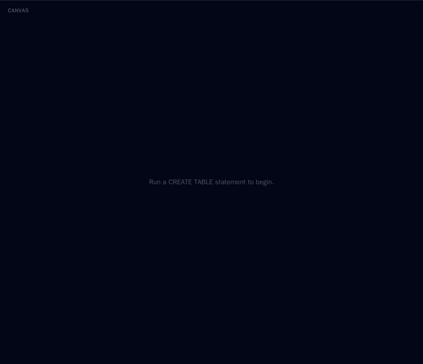
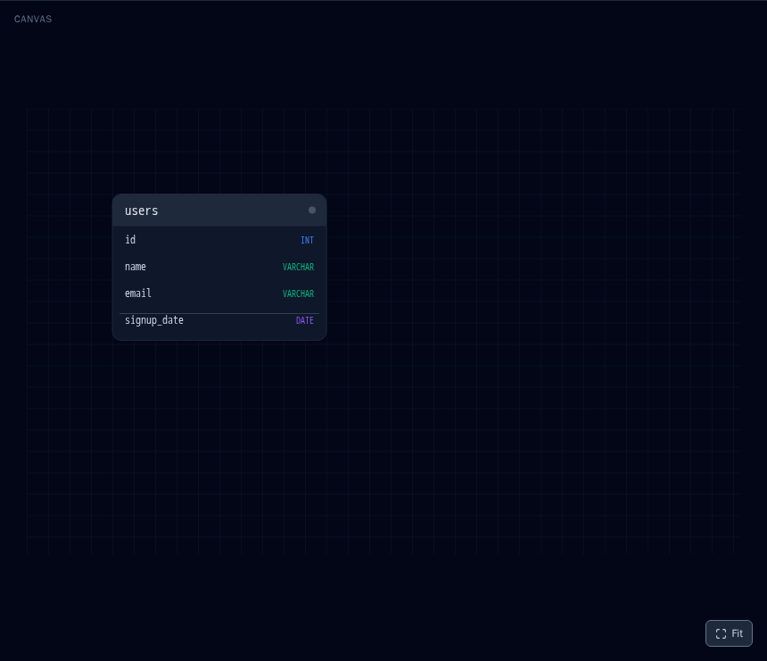
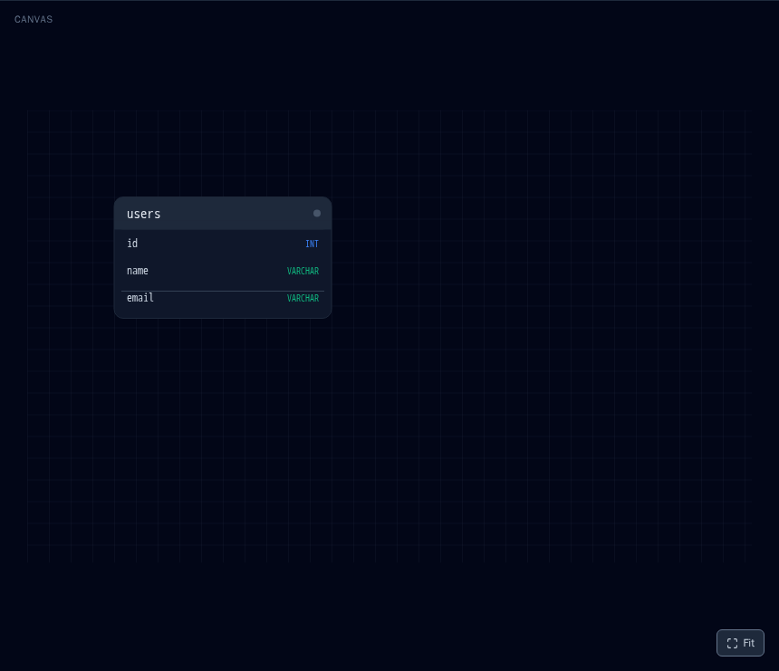
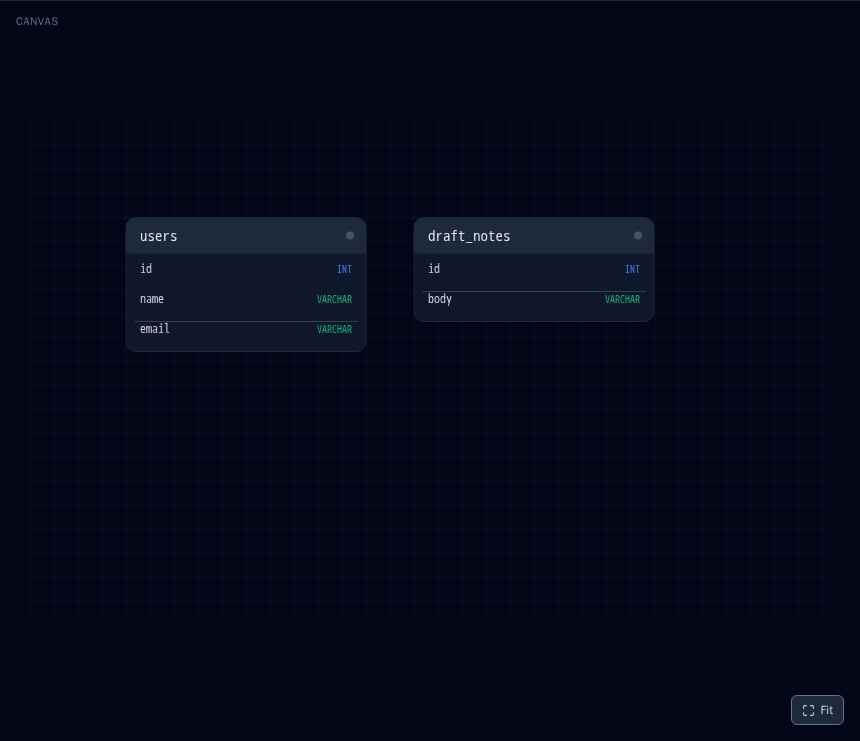
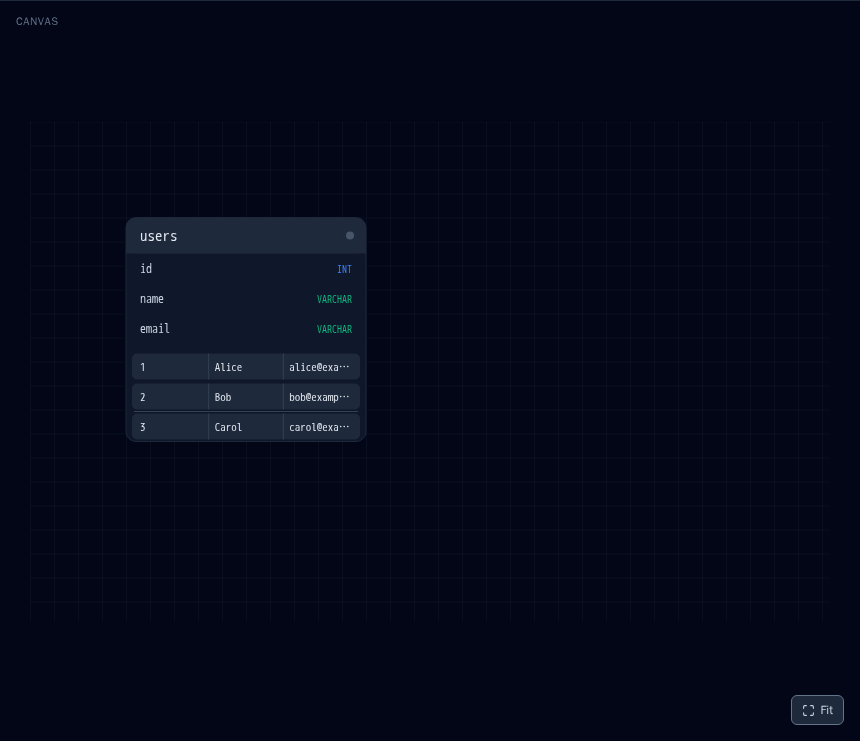
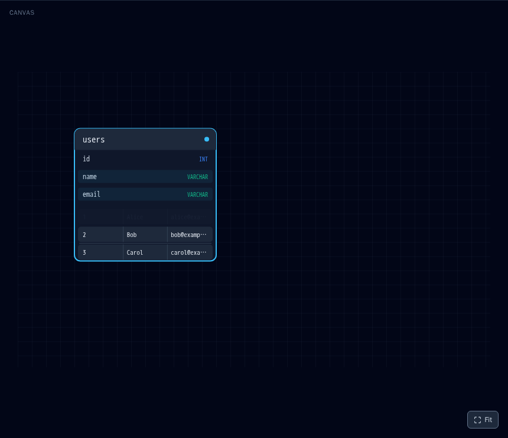
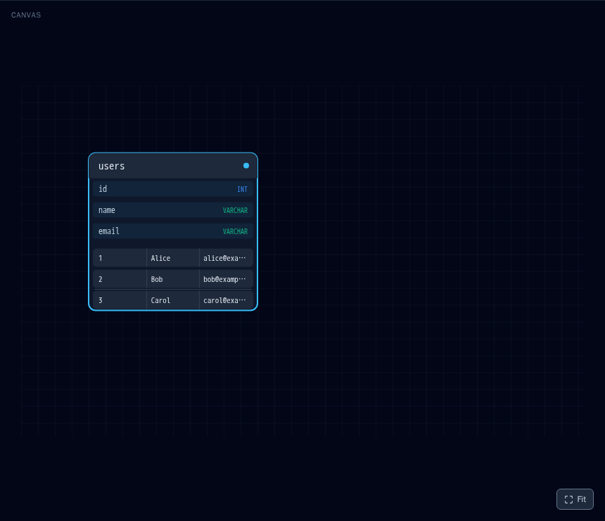
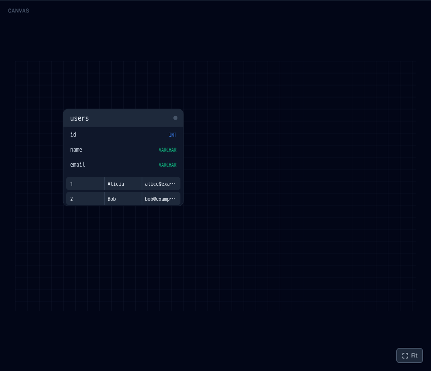

# 実行内容とアニメーション表示例（ギャラリー）

各 SQL 操作を実行したときに、キャンバス上で実際にどう見えるかを「実行前 → 実行後」の
スクリーンショット付きでまとめたドキュメント。README「## できること（現在の実装）」の
テキスト説明を視覚的に補完する（相互リンク）。

- 対応する `AnimationEvent` の唯一の正は [`src/types.ts`](../src/types.ts)。本ドキュメントの
  「生成イベント」欄はその写しであり、齟齬があれば `src/types.ts` が優先。
- 途中フレーム（フェードイン/アウトの過程、値更新時の一瞬のパルスなど）は静止画では
  表現しきれないため、各節の文章で補足している。

## 生成方法・更新運用

スクリーンショットは受け入れテストハーネス（`tools/acceptance-check/`、Docker + Playwright）の
決定論的シナリオで自動生成する。テーブル配置は `WORLD_W` ベースで決定論的
（[`src/layout.ts`](../src/layout.ts)）、撮影前に毎回 Fit でズームを正規化し、
framer-motion のトランジション収束を待ってから撮るため、生成物はコミット可能なほど安定する。

```bash
# 初回のみ
cd tools/acceptance-check && npm install && cd -
docker build -t sql-viz-acceptance-check tools/acceptance-check

# docs/assets/animation/*.png を再生成（約20枚。所要 5〜8分）
node tools/acceptance-check/orchestrate-phase-c-gallery.mjs
```

**更新運用**: Issue #47 / #48 等で対応 SQL が拡大し、新しい `AnimationEvent` や表示挙動が
入るたびに、`tools/acceptance-check/scenarios/phaseC-gallery.mjs` の `STEPS` に操作を追加して
上記コマンドを再実行し、本ドキュメントの該当節と `docs/assets/animation/` の画像を更新する。
生成物の差分が出た場合は「意図した表示変更か」をレビューしたうえでコミットする。

---

## `CREATE TABLE` — テーブル生成

```sql
CREATE TABLE users (id INT, name VARCHAR(50), email VARCHAR(120));
```

**生成イベント**: `table_appear`

新しいテーブルカードがキャンバスのグリッド位置にフェードインで出現する。列名と型
（`INT` / `VARCHAR` など）がヘッダー直下に並ぶ。設計モードでのみ実行可能。

| 実行前 | 実行後 |
|---|---|
|  |  |

---

## `ALTER TABLE ... ADD COLUMN` — カラム追加

```sql
ALTER TABLE users ADD COLUMN signup_date DATE;
```

**生成イベント**: `column_add`

対象テーブルカードの末尾に新しい列がフェードインで追加され、カードの高さがその分伸びる。
1 文につき単一アクションのみ対応。設計モード限定。

| 実行前 | 実行後 |
|---|---|
|  |  |

---

## `ALTER TABLE ... DROP COLUMN` — カラム削除

```sql
ALTER TABLE users DROP COLUMN signup_date;
```

**生成イベント**: `column_drop`

対象の列がフェードアウトして消え、カードの高さが縮む（退場は framer-motion の
`AnimatePresence` によるアンマウント時アニメーション）。設計モード限定。

| 実行前 | 実行後 |
|---|---|
|  |  |

---

## `DROP TABLE` — テーブル削除

```sql
DROP TABLE draft_notes;
```

**生成イベント**: `table_remove`

対象テーブルカード全体が退場アニメーションで消える。1 文につき単一テーブルのみ。
設計モード限定。（実行前の画像は、別途 `CREATE TABLE draft_notes (...)` を実行して
`users` と並べた状態。）

| 実行前 | 実行後 |
|---|---|
|  |  |

---

## `INSERT INTO ... VALUES` — 行の追加

```sql
INSERT INTO users (id, name, email) VALUES
  (1, 'Alice', 'alice@example.com'),
  (2, 'Bob',   'bob@example.com'),
  (3, 'Carol', 'carol@example.com');
```

**生成イベント**: `row_add`（追加行ごとに 1 件）

テーブルカードの列定義の下に、データ行が 1 件ずつ順番にフェードインで積まれていく。
実験モードでのみ実行可能で、追加された行は未コミットのトランザクションに乗る
（設計モードへ戻ると破棄される。最下段「実験→設計モード復帰」参照）。

| 実行前 | 実行後 |
|---|---|
|  |  |

---

## `SELECT ... WHERE` — フィルタとカラムハイライト

```sql
SELECT name, email FROM users WHERE id > 1;
```

**生成イベント**: `row_filter`（条件に一致しない行ごと）、`select_highlight`

- `WHERE` 条件に一致しない行は、配列から削除されるのではなく `filteredOut` フラグが
  反転し、キャンバス上でその場でフェード（薄く沈む）する。
- `SELECT` で指定した列（ここでは `name` と `email`）のヘッダーがハイライトされ、
  テーブルカードの外枠が強調表示になる。
- `WHERE` は `<col> <op> <value>` の単一比較のみ対応（`AND` / `OR` / `JOIN` は非対応）。

| 実行前 | 実行後 |
|---|---|
|  |  |

---

## `SELECT ... WHERE`（再一致）— フィルタ解除

```sql
SELECT id, name, email FROM users WHERE id > 0;
```

**生成イベント**: `row_unfilter`（前回除外され、今回一致した行ごと）、`select_highlight`

前の `SELECT` で除外されていた行が新しい条件に一致すると、フェードインで元の
表示に復帰する。（実行前の画像は直前の `WHERE id > 1` で `id = 1` の行が沈んだ状態。）

| 実行前 | 実行後 |
|---|---|
|  |  |

---

## `UPDATE ... SET ... WHERE` — 値の更新

```sql
UPDATE users SET name = 'Alicia' WHERE id = 1;
```

**生成イベント**: `row_update`（対象行ごと）

対象行が一瞬わずかに拡大するパルス（`scale` 1 → 1.05 → 1）とフラッシュで強調され、
セルの値が新しい内容へ差し替わる。パルス自体は約 0.3 秒で収まるため、下の「実行後」
画像では更新後の値（`Alice` → `Alicia`）だけが見える。実験モード限定。

| 実行前 | 実行後 |
|---|---|
|  |  |

---

## `DELETE FROM ... WHERE` — 行の削除

```sql
DELETE FROM users WHERE id = 3;
```

**生成イベント**: `row_remove`（対象行ごと）

対象行が退場アニメーションで消え、下の行が詰め上がる。実験モード限定
（削除も未コミットのトランザクション上の操作で、設計モードへ戻ると取り消される）。

| 実行前 | 実行後 |
|---|---|
|  |  |

---

## 実験 → 設計モード復帰 — ROLLBACK 差分の再生

**操作**: ヘッダーの `ModeToggle` で「実験モード」から「設計モード」へ切り替える。

**生成イベント**: 実験モード中に積んだ `INSERT` / `UPDATE` / `DELETE` を打ち消す向きの
`row_remove` / `row_update`（`diffStates()` が算出）。

実験モードで行ったデータ変更は未コミットのトランザクションに積まれており、設計モードへ
戻ると `ROLLBACK` でまとめて破棄される。その差分が通常のアニメーションとして再生され、
追加した行はすべて退場する。テーブル構造（`CREATE` / `ALTER` / `DROP` の結果）は設計
モードでしか変更できないため、この復帰の影響を受けない。（実行前の画像は
`INSERT` → `UPDATE` → `DELETE` を経た実験モードの状態、実行後は行が消えた `users` の
構造だけが残った状態。）

| 実行前（実験モード） | 実行後（設計モードへ復帰） |
|---|---|
|  |  |
